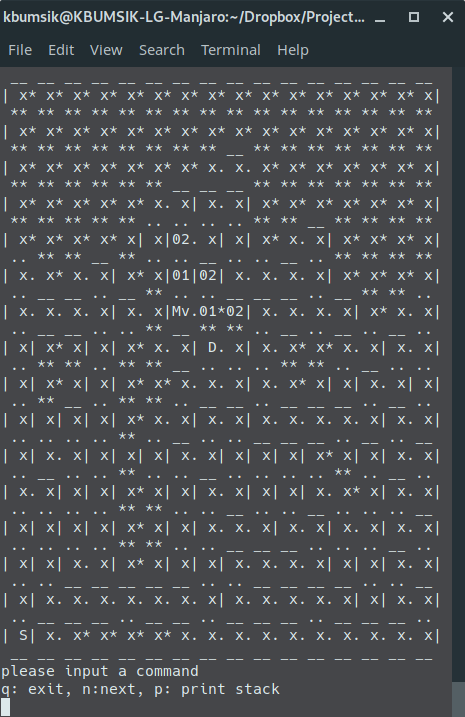
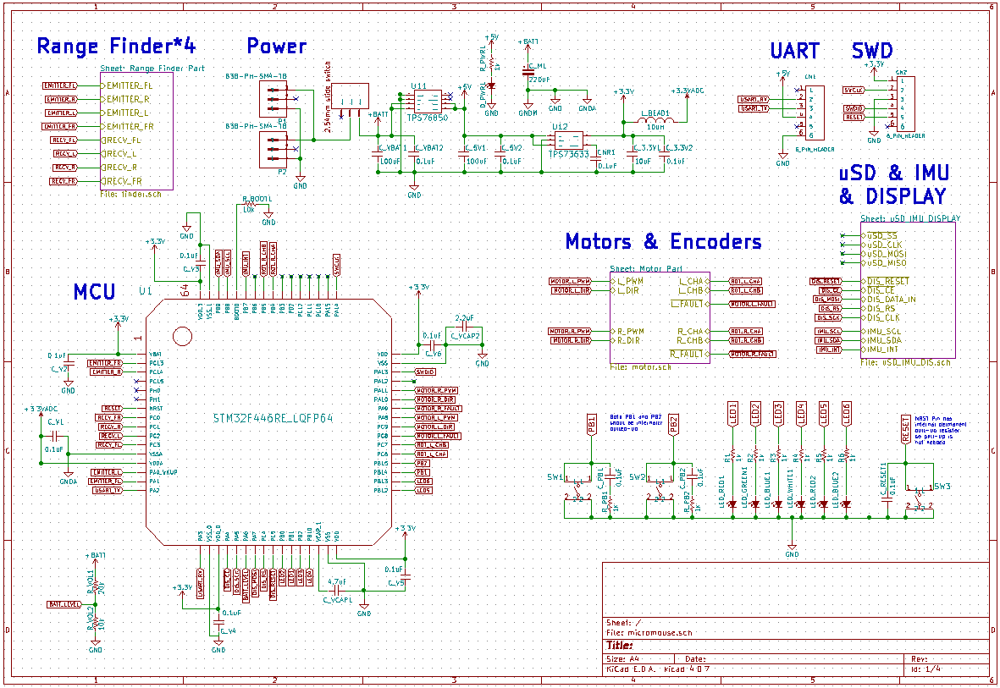

# WolfieMouse

WolfieMouse is a robotics project to build [a micromouse](https://en.wikipedia.org/wiki/Micromouse). This project covers three parts:

* Robotics algorithm for maze solving (C++)
* low-level hardware driver software (C and ARM assembly)
* Tools to capture and plot robot's sensor data (Python)
* Embedded hardware design and PCB design (KiCad, an open-source alternative to Altium)

This robot won **The Special Mention Award in 2018 IEEE Region 1 Micromouse Robotics Competition**.

## Get started

If you don't know what is micromouse competition, [this document will help.](doc/What-is-Micromouse.md).

Requires tools:
* [GNU Arm Embedded Toolchain](https://developer.arm.com/open-source/gnu-toolchain/gnu-rm) and [Makefile](https://www.gnu.org/software/make/manual/make.html) to build program for the robot.
* [OpenOCD](http://openocd.org/) to upload the program to the robot and to debug.
* [KiCad](http://kicad-pcb.org/) to design a PCB hardware.

Otherwise, a [Vagrant](https://www.vagrantup.com/) virtual machine environment is provided to skip installing the above tools.

If you whish to start with this project, see [get stared document](doc/Get-started.md).

## Documentation

See [documentation section.](doc/)

## Directory descriptions

* `doc`: Documentation folder
* `firmware`: The robot's program folder, including robotics algorithms and hardware drivers
* `simulation`: Programs to test algorithms on a desktop computer
* `tools`: Contains robot sensor data capturing tools and scripts for Vagrant machine.

## Gallery

Terminal-based simulation program. `M` stands for the position of the robot, `D` stands for the position of the goal in the maze, and `S` stands for the starting position.

Schematic overview.

PCB Footprint overview.

## License and Credits

Source code in `firmware` and `simulation` folders are licensed under [GPLv2.1](https://www.gnu.org/licenses/old-licenses/lgpl-2.1.en.html).

External libraries (FreeRTOS, CMSIS, STM32F4 HAL) under `firmware/lib` follow their own terms.

The fundamental hardware design is inspired by [Project Futura](http://micromouseusa.com/?page_id=1342) by [Green Ye](http://www.greenye.net/).